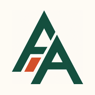
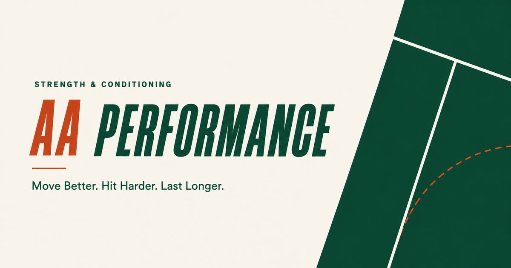

# 🎨 Amir Ardekani — Design System

A portable brand + design spec for generating on-brand content (Instagram carousels, **reels**, web sections). Paste any section into Claude (design or code) to get consistent output.

**Essence:** premium, clinical-but-warm, lots of breathing room. A "Roland-Garros" palette — deep green + clay on warm paper, with white court-lines and a clay ball-arc as the sport motif. **No yellow/gold.** Persian-first, RTL for social; English for the website/wordmark.

---

## 0. Brand marks & lockup



**App icon / monogram** — interlocking **green "A"s** with a single **clay parallelogram** cut through them, on a **cream** field. This is the master mark. Use it as the app tile (splash, lock-screen notification, home-screen icon). It already carries a paper background, so on a paper surface give it rounded corners (`border-radius` ≈ 24% of size) + a soft shadow so it reads as a tile instead of blending in.

<br clear="left">

**Wordmark lockup** (see `../assets/img/og-image.png`):
- **`AA`** in **clay** + **`PERFORMANCE`** in **green**, set in **Barlow Condensed, heavy, italic**.
- Eyebrow above: **`STRENGTH & CONDITIONING`** (green, small, tracked — Latin only).
- Tagline: **`Move Better. Hit Harder. Last Longer.`** (last clause in *italic*), with a short clay dash before it.
- Sport motif: a green panel carrying **white court lines** (low opacity) and a **dashed clay arc** (the ball path). Use it as a corner/background accent, never busy.



**Names:** brand person = **Amir Ardekani** · app/product = **AA Performance** · handle = **@amirardekani · AMIRARDEKANI.COM**

---

## Signature sign-offs (use one on every piece)

- **«هیچی بی‌دلیل نیست»** — *nothing (in your program) is without a reason*
- **«یه مربی تو جیبت»** — *a coach in your pocket*

**The mantra** — the two-line lockup, setup → payoff: **«یه نقشه تا هدفت»** (*a map to your goal*) → **«یه مربی تو جیبت»** (*a coach in your pocket*). This is the canonical close. *(Confirmed wording — drops the older «کامل» and the comma. The «نقشه/map» line is also the literal idea behind the Carousel-Kit's rally-arc + court motif.)*

**The canonical outro** (the close we use to end reels — setup line, then payoff, then brand row):

> یه نقشه تا هدفت.
> ## یه مربی تو جیبت.
> Ⓐ امیر اردکانی · دایرکت بده 📩

- Setup line ≈ `mid` weight, full white. Payoff = the big line, with **مربی** in clay.
- English alt (for the website/wordmark): **Move Better. Hit Harder. Last Longer.**

---

## 1. Color tokens

| Role | Hex | Use |
|---|---|---|
| **Green (primary / "ink")** | `#0E4A36` | dark-slide background; dark text/headings on light; **the app's primary UI colour** |
| Green-2 | `#156A4D` | gradients paired with the green |
| **Clay (the ONE accent)** | `#C7552F` | highlights, buttons, eyebrows, the header dot, accent words, the ball-arc |
| Clay-2 (lift) | `#E06B43` | clay text on **dark** surfaces (a touch brighter so it pops) |
| **Paper** | `#FAF7F2` | light-slide background; light text on dark; app background |
| Paper-2 | `#F1ECE3` | secondary warm surface |
| Ink | `#1A1A1A` | body text on light surfaces |
| Ink-2 | `#5C5C5C` | muted body / captions on light |
| Good / Bad | `#1F7A4D` / `#C0392B` | ✅ / ❌ semantic only |
| Stage bg | `#0c0f0b`→`#16161A` | cinematic room behind a phone/device (dark green→near-black radial) |

**Color rules**
- Single accent = **clay**. There is no second accent (the old gold/yellow is **retired** — do not reintroduce it, even on green).
- Any **solid clay block uses white text** (`#fff`).
- Accent text is clay on every surface. On **dark** surfaces use **Clay-2** (`#E06B43`) for a little more pop.
- Highlight blocks (`.hl`) = clay background + white text.
- **Court-line white** on green = `rgba(255,255,255,.16–.5)` only — never solid.

---

## 2. Typography

- **Farsi: Vazirmatn** (400–900) — used for *everything* Persian. Headlines 800–900, body 400–600.
- **Latin display / wordmark: Barlow Condensed** (700–900, **italic** for the AA PERFORMANCE lockup; big stat numbers use it upright at 900).
- **Latin UI / app text / labels: Barlow** (500–900). This is what the real app renders in, so any "screen inside a phone" uses Barlow.
- **Latin numerals & counters: Barlow Condensed.** (JetBrains Mono is an optional alt only if you want a deliberately technical look — not the default.)

**⚠️ Two hard Farsi rules**
1. **Never apply `letter-spacing`** — it breaks Persian cursive joining (letters disconnect).
2. **No UPPERCASE** (meaningless in Farsi). Use **Persian numerals** (۰۱ / ۰۵).

**Type scale @ 1080×1350 (carousel)**
- Cover headline 108–112 · big statement 112–118 · section/compare 84–92
- Rule-card title 52 · body/sub 36–44 · eyebrow/chip 28–30 · counter 24 · edge padding **64**

**Type scale @ 1080×1920 (reel)**
- Big 92–104 · mid 62–66 · sub 42–46 · eyebrow 34–36 · edge padding **88**

---

## 3. Canvas & layout

- **Carousel slide:** 1080×1350 (Instagram 4:5).
- **Reel:** 1080×1920 (9:16).
- Always `dir="rtl"` for Farsi. **Exception:** force `direction:ltr` on numeric counters/handles (e.g. «۱ / ۸»), or RTL flips them to «۸ / ۱». A phone mock-up rendering the (English) app is also `dir="ltr"`.
- Generous negative space — text sits in the lower or center third, never crammed.
- **Frame:** a thin inset border — `margin:28px; border-radius:14px;` color `rgba(255,255,255,.16)` on dark / `rgba(0,0,0,.18)` on light.

---

## 4. Core components

- **Header:** handle + clay dot only. *(The page counter «۰۱ / ۰۵» is **retired** — position is shown by the pagination balls instead.)*
- **Footer:** **tennis-ball pagination** — one small ball per slide (grey = other slides, **orange/clay = the current slide**, slightly scaled + glow), the row laid out **ltr** even on RTL slides — plus a **swipe** indicator on slide 1 only («بکش», arrow points left, the RTL direction). *(Replaces the old segmented progress bar.)*
- **chip-A** — solid clay block, white text (a hard label, e.g. «اشتباهِ رایج»).
- **chip-B** — clay text + a 64px clay leading dash (an eyebrow, e.g. «حرفِ راست»).
- **.hl** — clay highlight block behind a key word, white text.
- **.acc** — clay-colored accent word (clay-2 on dark).
- **.strike** — clay bar struck through a word (for myths).
- **Buttons:** *primary* = clay pill + white text; *ghost* = 2px outline, paper text. Pill-shaped.

---

## 5. Cards & imagery

- **Compare columns:** *bad* = ghosted outline card with **strikethrough** (muted); *good* = **solid clay** card, white text.
- **Rule-cards:** green card + **clay check-circle** (white tick) + **clay number** + white title + muted sub.
- **App images — always image-on-top, with a green scrim + caption overlaid** (shows the real photo fully, like the app does):
  - Cycle banner **16/9** · Day banner **5/2** (give it room — at 5/2.5 a 2-line title won't collide with the eyebrow) · Workout banner **2/1**
- **Real assets to reuse:** `../assets/cycles/*.jpg` (foundation-forge, strength-engine, structural-build, durability-build, armour-build…) and `../assets/days/*.webp` (lower, upper, power, conditioning…). Use these, not stock — they *are* the product.

**Photo-led carousels (lifestyle / personal photography)** — a whole narrative deck can ride on **real photos** (you training, your kit, the city at night), not just type. Reference build: `carousel-recovery-run.html`.
- Each photo is **full-bleed** (`object-fit:cover`; shoot/crop **portrait 4:5**, ≈1122×1402) behind a green scrim, headline + sub in the lower third. Set an **`object-position` focal point per photo** so a face / the watch / the subject never crops to the edge.
- **Standard photo scrim** (keeps white text legible on any image *and* tints it brand-green): `linear-gradient(to top, rgba(8,38,27,.94), rgba(8,38,27,.18) 56%, rgba(8,38,27,.58))`. Push the bottom stop toward `.96` if a bright/busy frame fights the text.
- **The photography "look" — grade before you place.** Cinematic and moody, *not* bright-and-poppy: deep, slightly **green-leaning shadows**; **warm paper-cream highlights**; **muted, controlled saturation** — except where a **clay/terracotta** accent already lives in-frame (a lifebuoy, brake-lights, sodium street-lamps), which you let pop. Filmic contrast, faint grain, soft vignette. Grade **all** slides off one base so the set reads as one world, even mixing a dim living-room and a blue-hour dock.
- **Proof / data slide** — to show real receipts (a logged run, a dashboard): frame the **actual screenshot inside a phone card** (rounded, hairline border, soft shadow) on a green canvas, and restate the 2–3 headline numbers as **branded KPIs** (big clay Persian numerals + muted label). Authentic artifact + on-brand readout. (Slide 8 of the recovery-run deck.)

---

## 6. Slide & reel template library

Cover · Myth (strike) · Statement · Stat (one big number) · Quote · **Compare** (file/coach) · List · **Rule-cards** · Heatmap · **CTA** (canonical outro) · **Feature** (full-bleed app image) · **Journey** (linked cycle timeline) · **Result** (proof + face) · **Checklist** · **Photo-story** (full-bleed lifestyle photo + green scrim) · **Proof** (real screenshot in a phone card + branded KPIs) · **App-as-Product** (cinematic phone — see §7).

**Carousel graphics layer — "RALLY"** (lives in `Carousel-Kit.html`, the 23-template kit):
- **The rally arc** — ONE dashed clay ball-path per slide (`stroke:var(--clay)`, clay-2 on dark, `stroke-dasharray: 2 26`, round caps), placed in negative space, ending in a **clay tennis ball** (a real ball PNG, base64-embedded as the `#tennis-ball` SVG symbol, ~32px). Under `.fa` the arc group is mirrored `scaleX(-1)` so the shot travels the RTL reading direction — an authored dot at `cx` displays at `1080−cx`. On the CTA the ball lands near the mantra payoff.
- **Court-line substrate** — faint court geometry (baseline + service box + centre line) raked across the lower third; white `rgba(255,255,255,.16)` on green, green `rgba(14,74,54,.10)` on paper. Open type-led slides only — never on dense card/grid slides.
- **Film grain** — a barely-there fractal-noise texture on every canvas (SVG data-URI tile, opacity ~.05, **no blend-mode** — compositing blend layers across many canvases hangs the page).
- **Tennis-ball pagination** — see §4. Page counters are retired.
- Backgrounds are **flat** green/paper (a clay "stadium-lamp" glow was tried and rejected). The **AA monogram is not used as in-slide chrome** (header chips/sign-off seals were tried and rejected as messy) — the Bio slide's photo + AA PERFORMANCE card are the only logo carriers.
- Carousels are **generated via the `/carousel` Claude Code skill** (`.claude/skills/carousel/SKILL.md`): script in → finished `Content/carousel-<slug>.html` + IG caption out. It reads `PRODUCT.md` + this file first, every run.

---

## 7. Reels & motion ⭐

The reel language we use. Build at 1080×1920; the page **auto-scales to the viewport** (`transform:scale(min(w/1080,h/1920))` on a `fitwrap`), so it always fills the frame for recording.

**House ease (everything):** `--ease: cubic-bezier(.16,1,.3,1);`

**Beat/scene model.** A reel is a timed sequence of *beats*. Two shapes:
1. **Scene-swap** (reels 1–3): full-screen scenes, only the active one has `.on`. A JS driver advances by `data-dur` (ms), runs a progress bar, and loops.
2. **Persistent-subject** (reel 4, "App-as-Product"): one element stays on screen (the **phone**) while *layers inside it* swap. Reads like one continuous take — the most cinematic option, and our signature for product reels.

**Stagger reveal.** Children get `.rise`/`.u` (`opacity:0; translateY(38–48px)`) and animate in when the parent gets `.on`, using `transition-delay` to cascade (~.12s steps).

**Timing.** 2–6s per beat; **hook in the first 2s**; total ~30–40s. Captions are **burned in** (most watch muted): a clay eyebrow + a white/ink line, re-played (remove/re-add a `.show` class) on every beat.

**Numbers.** Count-up with an ease-out + Persian-numeral conversion (`'۰۱۲۳۴۵۶۷۸۹'[d]`, decimal → `٫`). Remember the **bidi `direction:ltr`** rule for counters.

### Phone mock-up spec (App-as-Product)

A persistent device, app UI animating inside:
- **Room:** dark green→black radial (`stage bg`) + a vignette, so the phone glows.
- **Device:** ~556×1136, `border-radius:62`, `padding:14`, dark gradient body, shadow `0 60px 130px rgba(0,0,0,.62)` **+ a clay halo** `0 0 140px rgba(199,85,47,.16)`. A slow 6.5s float idles it.
- **Screen:** ~532×1108, `border-radius:48`, paper bg, **`dir="ltr"`**, Barlow. A **dynamic-island** pill (128×34) + a **status bar** (58px: time / signal / 5G / battery). Status bar text = ink on light screens, **white on dark** screens (and dark screens must extend *under* the bar, or the white text lands on paper and vanishes).
- **Screen transitions:** base `opacity:0; translateY(22px) scale(.985)` → `.on`.
- **Render the *real* app** (authenticity sells the product): English copy, Barlow, paper background, **green as the primary** UI colour, **clay as the highlight** — same two brand colours, green just leads on product surfaces.

**Canonical app beats** (storyboard for the product reel): Lock screen → app opens (splash) → today's program (cycle + day banners) → exercise video (play→scrubber + coaching cue) → log weight + RPE → **readiness check** (use the app's real questions: sleep / energy / soreness / stress, 1–5) → coach message (typing→reply) → **coach sees it live** (dashboard updates the instant the athlete logs) → canonical outro.

```css
:root{ --ease:cubic-bezier(.16,1,.3,1); }
.scene{position:absolute;inset:0;opacity:0;transition:opacity .55s var(--ease);}
.scene.on{opacity:1;}
.rise{opacity:0;transform:translateY(44px);
  transition:opacity .7s var(--ease),transform .7s var(--ease);}
.scene.on .rise{opacity:1;transform:none;}
.count{direction:ltr;}            /* «۱ / ۸» must not flip to «۸ / ۱» */
```

---

## 8. Ready-to-paste tokens (CSS)

```css
:root{
  /* Roland-Garros — green + clay + paper. NO yellow. */
  --green:#0E4A36; --green-2:#156A4D;
  --clay:#C7552F;  --clay-2:#E06B43;        /* clay = the only accent; clay-2 = on dark */
  --paper:#FAF7F2; --paper-2:#F1ECE3; --ink:#1A1A1A; --ink-2:#5C5C5C;
  --good:#1F7A4D;  --bad:#C0392B;  --stage:#0c0f0b;
  --line:#E7E2D9;                            /* hairline on paper */
  --fa:'Vazirmatn',sans-serif;               /* Farsi — everything */
  --latin:'Barlow',sans-serif;               /* Latin UI / app text */
  --display:'Barlow Condensed',sans-serif;   /* wordmark, big numerals */
  --ease:cubic-bezier(.16,1,.3,1);           /* the house ease */
  --pad:64px;                                /* 88px on reels */
}
/* dark slide  */ .dark {background:var(--green);color:var(--paper);}
/* light slide */ .light{background:var(--paper);color:var(--ink);}
.hl {background:var(--clay);color:#fff;padding:0 .12em;}   /* highlight a word */
.acc{color:var(--clay);}                                   /* accent a word    */
.dark .acc{color:var(--clay-2);}                           /* lift on dark     */
*{letter-spacing:0;}                                       /* never space Farsi */
```

---

## 9. Production & portability

- **Record at 1080×1920.** The reel scales to the window; the controls/progress chrome sits *outside* the device-room — crop to the canvas and they won't appear.
- **Make every reel self-contained.** Inline images as **base64 data URIs** so a file works *copied anywhere / offline* (a 50 KB image → ~70 KB of text; negligible for a local recording file). Without this, moving the `.html` away from its `assets/` folder — or OneDrive "files on-demand" not having synced an image — silently breaks pictures.
- Use the **smallest icon that covers the display size** before embedding (e.g. `icon-192.png` for anything ≤192px) to keep files lean.
- **Caveat:** fonts still load from Google Fonts (needs internet). For *true* offline, embed the woff2 via base64 `@font-face` too.
- **File naming:** `reel-N-name.html` (e.g. `reel-4-app.html`). Reels 1 & 3 are pure CSS (no assets); reels with imagery (2, 4) get the base64 treatment.

---

## 10. Voice & content rules

- **Language:** Persian/Farsi, **colloquial Tehrani** — warm, direct, confident, no fluff. (The English wordmark voice is sharp & athletic: *Move Better. Hit Harder. Last Longer.*)
- **Audience:** general-fitness clients in the Farsi market (not only athletes), even though the English site speaks to competitive tennis/padel players. Speak to the everyday trainee.
- **Goal of content:** justify the premium price & retain clients (show depth and the behind-the-scenes work) — not cheap lead-gen.
- **Format:** vertical reels/carousels, hook in the first 2 seconds, **burned-in captions** (many watch muted).
- **Credibility to lean on when useful:** ارشدِ قدرت و آمادگی · ارشدِ فیزیولوژیِ ورزشی (two MSc degrees) · ۵۰۰+ ورزشکار. *(In Farsi say «ارشد», never "MSc".)*
- Lead with the **no-BS / "everything has a reason"** idea; close with the **canonical outro** + handle.
- **Accuracy of claims:** he holds an exercise-physiology ارشد and fact-checks, so every training/physiology number must be right. Prefer a **simple round figure with no on-slide math** (e.g. «ضربانِ قلب، زیرِ ۱۴۰») over a formula or a percentage you haven't verified. Note: Zone 2 is a metabolic threshold (LT1/VT1 ≈ lactate 2 mmol/L), **not** a fixed % of max HR — don't publish "60–70% of max" as if it were exact.

**Farsi word choices — use these exact terms (decided with the client):**
- **His title:** «مربیِ بدنسازیِ حرفه‌ای» — *not* «مربیِ قدرت و آمادگی». Keep «قدرت و آمادگی» only inside the real degree names.
- **Degrees:** «ارشد» — never "MSc" → «ارشدِ قدرت و آمادگی» · «ارشدِ فیزیولوژیِ ورزشی».
- **The cheap alternative:** call it «یه برنامه» / «یه برنامه‌ی آماده» — *never* «فایل» or «PDF». Frame the offer as *«فقط یه برنامه نیست — یه تجربه‌ی کاملِ مربی‌گریه»* (it's not just a program, it's a full coaching experience).
- **Training intensity / RPE:** «شدت» — *not* «سختی».
- **Call-to-action verb:** «شروع کن» (begin) — *not* «درخواست» (apply).
- **Proof / credentials word:** «تجربه» (experience) — *not* «پشتوانه».
- **Pricing (Iran residents):** «معادلِ ۲۵ دلار در ماه — به تومان، با نرخِ روز» (pegged to USD, charged in Toman); abroad → DM. Pricing headline: «یه مربیِ کامل، با قیمتی کم‌تر از اون‌چه فکرشو می‌کنی.»
- **Handle:** Instagram **@amirardekanian** · site **amirardekani.com** *(the reels use @amirardekani — confirm which is canonical).*
